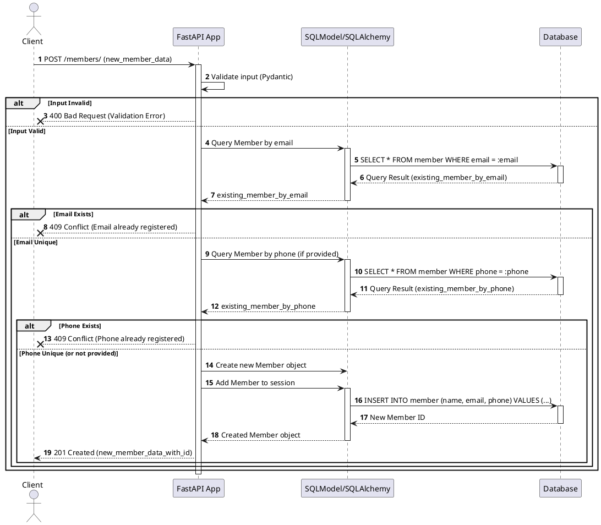

# Requirements: Python Jogja Member Management API - Add New Member

## 1. Feature Description

As a Python Jogja community organizer, I want to add new members to our database, so that we can keep track of our community growth and communicate with them.

## 2. Data Model (`Member`)

The `Member` entity will have the following structure:

* `id`: Primary Key, Integer, Auto-increment (Optional, handled by SQLModel)
* `name`: String, Required
* `email`: String, Required, Unique, Valid Email Format
* `phone`: String, Optional, Unique (if provided)

## 3. Business Logic

When a request to add a new member is received:
* **Uniqueness Check:**
    * If the provided `email` already exists in the database, the request should be rejected.
    * If the provided `phone` (and it's not null) already exists in the database, the request should be rejected.
* **Creation:** If all validations pass, a new `Member` record should be created in the database.

## 4. Validation

* **Client-side:** (Not in scope for API, but assumed basic validation)
* **API (Pydantic):**
    * `name`: Must be a non-empty string.
    * `email`: Must be a valid email format and a non-empty string.
    * `phone`: Must be a string (optional).
* **Database-side (Business Logic):**
    * `email`: Enforce uniqueness.
    * `phone`: Enforce uniqueness (if provided).

## 5. API Endpoint

* **Method:** `POST`
* **Path:** `/members/`
* **Request Body:** JSON object conforming to the `MemberCreate` schema (derived from `Member` model, perhaps excluding `id`).
* **Success Response:** `201 Created` with the newly created `Member` object.
* **Error Responses:**
    * `400 Bad Request`: For invalid input format (Pydantic validation errors).
    * `409 Conflict`: If email or phone already exists.
    * `500 Internal Server Error`: For unexpected server issues.

## 6. Sequence Diagram

